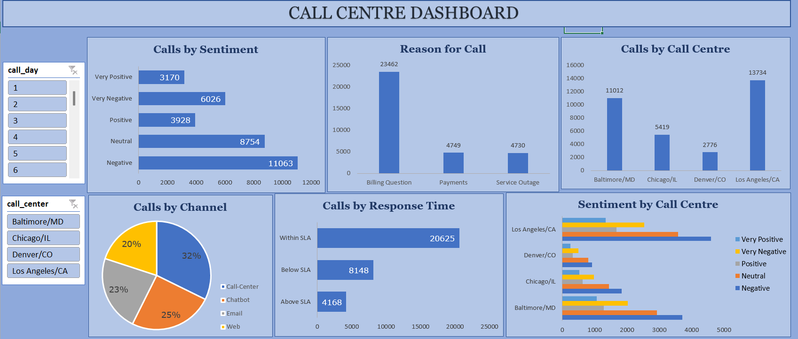

# 📞 Call Centre Dashboard (Microsoft Excel)

## 📌 Project Overview

This project is an interactive Call Centre Dashboard built in Microsoft Excel. It analyzes customer service call data to provide actionable insights into call volume, customer sentiment, response time performance, communication channels, and call centre operations through dynamic visualizations.

---

## 🎯 Objectives

- Monitor overall call centre performance.
- Analyze customer sentiment across different call centres.
- Track SLA (Service Level Agreement) compliance.
- Identify the most common reasons for customer calls.
- Compare communication channels and call centre workloads.
- Enable interactive filtering using slicers.

---

## 📊 Dashboard Features

- 📈 Calls by Customer Sentiment
- 📞 Calls by Call Centre
- 📋 Calls by Reason
- 📡 Calls by Communication Channel
- ⏱ Response Time Analysis (Within SLA, Below SLA, Above SLA)
- 🏢 Sentiment Analysis by Call Centre
- 🎛 Interactive Slicers for Call Day and Call Centre

---

## 📂 Dataset

The dataset contains customer service call records with the following fields:

- Customer ID
- Customer Name
- Customer Sentiment
- CSAT Score
- Call Date
- Call Day
- Reason for Call
- City
- State
- Communication Channel
- Response Time (SLA Status)
- Call Duration (Minutes)
- Call Centre

---

## 🛠 Tools Used

- Microsoft Excel
- Pivot Tables
- Pivot Charts
- Slicers
- Data Cleaning
- Data Analysis
- Dashboard Design

---

## 📸 Dashboard Preview

---

## 📊 Key Insights

- Billing Questions account for the highest number of customer calls.
- Los Angeles/CA handles the largest call volume.
- Call-Center is the most frequently used communication channel.
- Most customer interactions are completed **Within SLA**.
- Negative and Neutral sentiments are more common than Positive sentiments.
- Customer sentiment varies across different call centres.

---

## 🚀 How to Use

1. Download **Call_Centre_Dashboard.xlsx**.
2. Open the workbook using Microsoft Excel (2016 or later recommended).
3. Navigate to the **Dashboard** worksheet.
4. Use the **Call Day** and **Call Centre** slicers to interact with the dashboard.
5. Explore charts to analyze customer service performance.

---

## 📌 Skills Demonstrated

- Data Cleaning
- Dashboard Development
- Data Visualization
- Business Intelligence
- Pivot Tables
- Pivot Charts
- Interactive Reporting
- KPI Analysis
- Customer Service Analytics

---

## 👤 Author

 Bhawna saini

 
